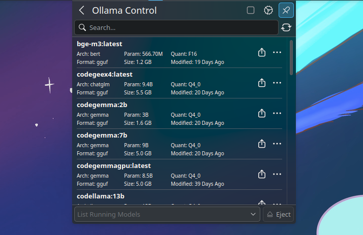
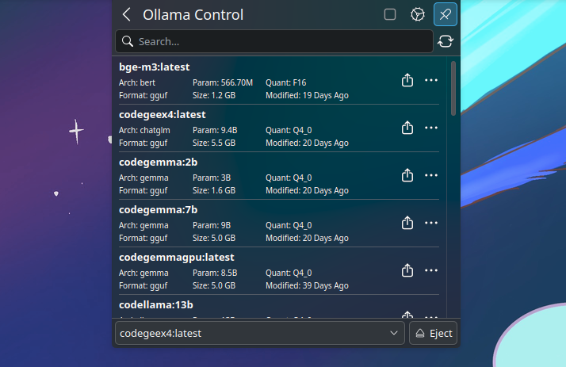

# Plasmoid Ollama Control

## Features

- [X] Start / Stop Ollama from applet
- [X] List Models
- [X] List Running Models
- [X] Load / Unload Model
- [ ] Show Model Info
- [X] Copy
- [X] Delete
- [ ] Pull
- [ ] Update

## Screenshots




## Package Dependencies

### Arch

```bash
sudo pacman -S curl kdeplasma-addons
```

## Installation

### KDE Store (Recommended)

[Store link](https://store.kde.org/p/2196368/)

1. Right click on the desktop
2. Click on "Enter Edit Mode"
3. Click on "Add Widgets"
4. Click on "Get New Widgets"
5. Click on "Download New Plasma Widgets"
6. Search for "Ollama Control"
7. Click on "Install" and you're done!

Go to Configure System Tray > Entries > System Services then choose "Show when relevant" or "Always shown"

### Build it Yourself

```bash
git clone https://github.com/imoize/plasmoid-ollamacontrol.git
cd plasmoid-ollamacontrol
kpackagetool6 -t Plasma/Applet -i package
```

Restart plasmashell
```bash
systemctl --user restart plasma-plasmashell
```

Go to Configure System Tray > Entries > System Services then choose "Show when relevant" or "Always shown"